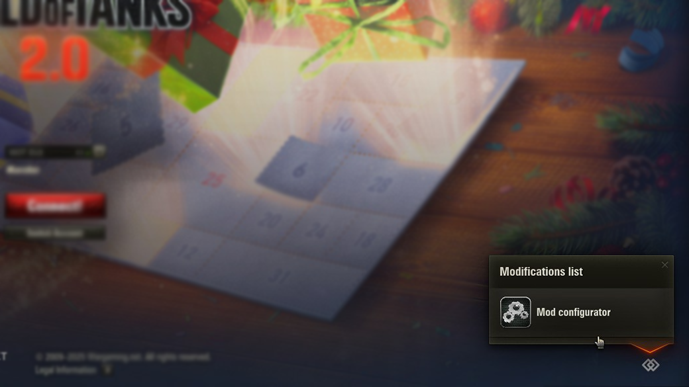
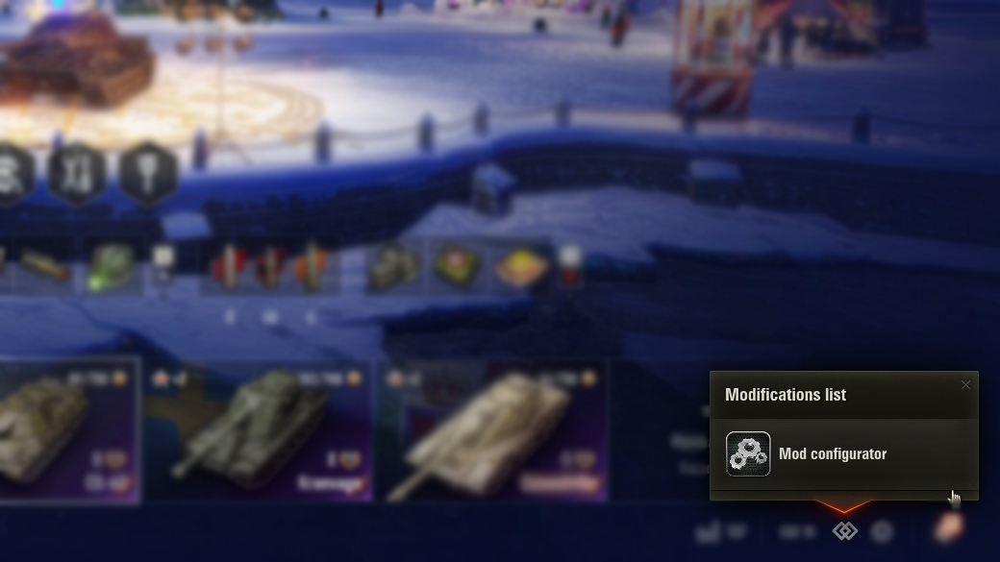
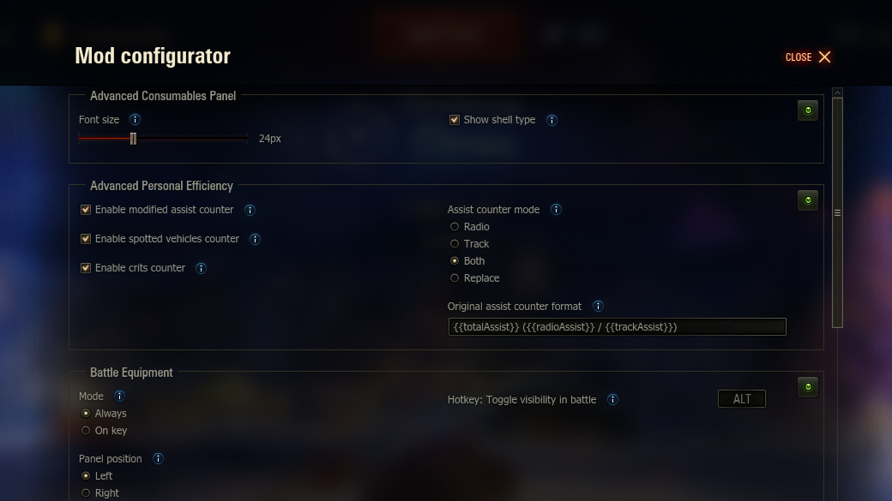

# ModsSettings API

API and tools for adding in-game settings support to World of Tanks mods.

Provides a unified settings interface and helpers so third-party modders can easily register custom settings dialogs and persist user configuration.

## Features

- Exposes an API for creating and managing mod settings UI.
- Lets other mods add their own configuration screens without manual UI coding.
- Manages loading, saving, and presentation of settings automatically.

## Dependencies

- [ModsList API](https://gitlab.com/wot-public-mods/mods-list) — required dependency to open the settings window.

## Screenshots

### ModsList entry in login:

### ModsList entry in lobby:

### ModsSettings window:

## Contributing

Contributions, bug reports, and pull requests are welcome — especially enhancements for better settings UI components.
