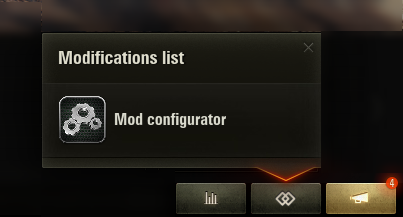

# NOTICE

Repository migrated to [https://github.com/IzeBerg/modssettingsapi/](GitHub) and no longer maintained here on BitBucket.

# ModsSettings API

This modification provides an API for third party developers to create settings for other modifications inside game easily.  
Requires [ModsList API](https://gitlab.com/wot-public-mods/mods-list) as a dependency to allow opening the settings window.

## Preview

